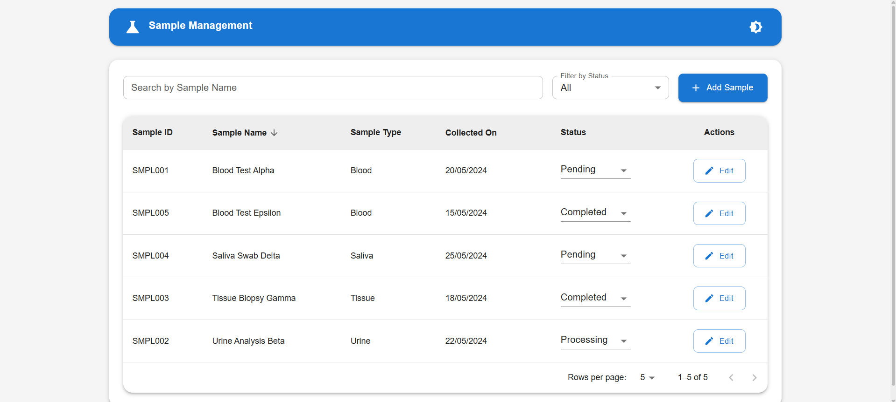
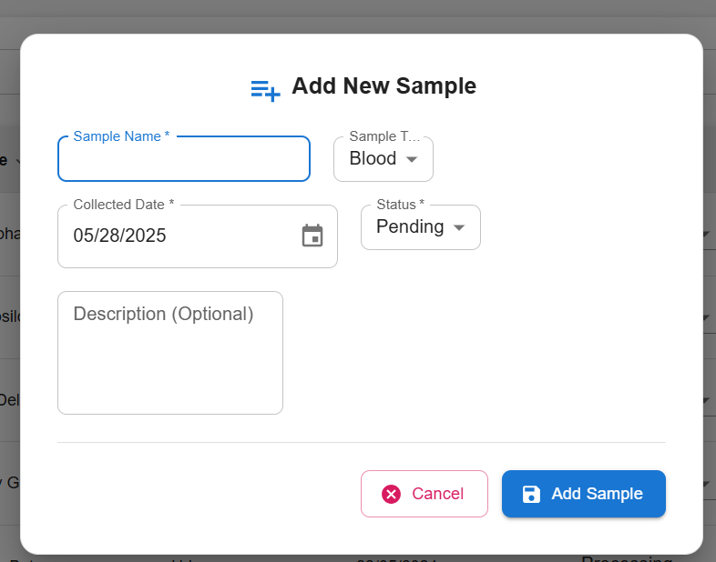
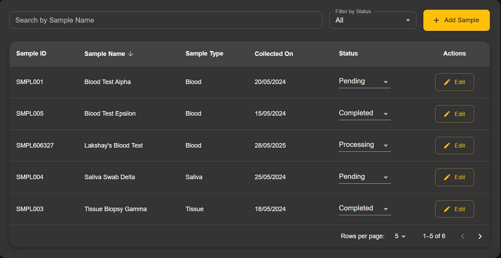
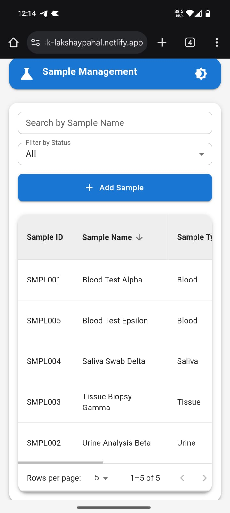

# Sample Management Dashboard - YLIMS

A modern, responsive laboratory sample management system built with React and Material UI. This dashboard provides an intuitive interface for managing laboratory samples with features like real-time search, filtering, sorting, and dark/light mode support.

## 🎥 Video Demonstration
[Watch the demo video here](https://youtu.be/AcMYfUaXNuc)

## 🌐 Live Demo
Here is the live Deployment link of the project:
https://arbro-task-lakshaypahal.netlify.app/

## 📸 Screenshots

### Dashboard View


### Sample Management




### Mobile Responsive View


## ✨ Features

- **Comprehensive Sample Management**
  - Add, edit, and track laboratory samples
  - Real-time search and filtering
  - Sortable columns
  - Pagination support
  - Status tracking with visual indicators

- **Modern UI/UX**
  - Clean, intuitive interface
  - Dark/Light mode support
  - Responsive design for all devices
  - Material Design components
  - Smooth animations and transitions

- **Advanced Functionality**
  - Client-side data management
  - Form validation
  - Date handling with date-fns
  - Optimistic UI updates
  - Custom status badges

## 🛠️ Technology Stack

- React 19
- Material UI v7
- Vite
- date-fns
- ESLint

## 🚀 Getting Started

1.  **Clone the repository:**
    ```bash
    git clone [https://github.com/LakshayPahal/Arbro-Pharma-Frontend-Task.git](https://github.com/LakshayPahal/Arbro-Pharma-Frontend-Task.git)
    ```

2. **Install dependencies**
   ```bash
   npm install
   ```

3. **Start development server**
   ```bash
   npm run dev
   ```

4. **Build for production**
   ```bash
   npm run build
   ```

## 📁 Project Structure

```
src/
├── components/
│   ├── SampleForm.jsx
│   ├── SampleTable.jsx
│   └── StatusBadge.jsx
├── contexts/
│   └── ThemeModeContext.jsx
├── data/
│   └── mockSamples.json
├── App.jsx
├── main.jsx
└── index.css
```

## 🔧 Development

- **Code Style**: ESLint configuration included
- **State Management**: React Hooks
- **Styling**: Material UI with custom theme
- **Date Handling**: date-fns for consistent date formatting

## 👤 Author

Lakshay
